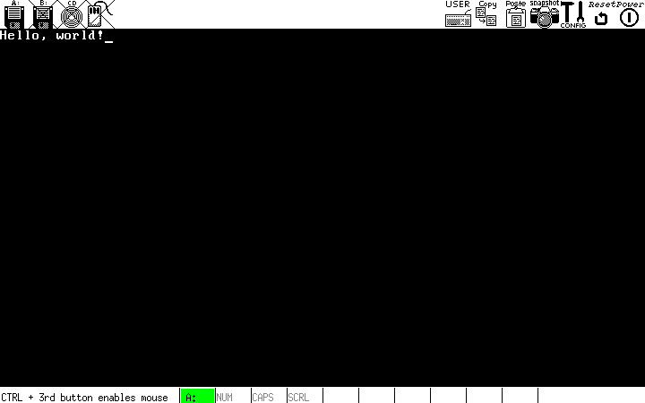

# Layar

Jadi, sekarang kita memiliki ``kernel``yang dapat berjalan dan menempatkan dirinya ke dalam 
infinite loop, saatnya untuk menampilkan sesuatuyang menarik pada layar. Seiring dengan serial I/O, 
monitor akan menjadi bagian terpenting kita dalam pertempuran saat debug.

## Teori

Kernel kita di boot oleh GRUB dalam mode teks. Artinya, telah teredia frambuffer (area mamori) yang 
mengontrol layar karakter (bukan piksel) dengan lebar 80x tinggi 25. Ini akan menjadi mode kernel kita akan 
beroperasi sampai kita masuk ke bagian VESA.

Area memori yang deknal sebagai _framebuffer_ dapat diakses seperti RAM, di alamat ``0xB8000``. Penting untuk dicatat, 
bagaimanapun, itu sebenarnya bukan _RAM_. Ini adalah bagian dari memori video khusus pengontrol VGA yang telah diciptakan 
memori melalui perangkat keras ke ruang alamat linier kita. Ini adalah perbedaan penting.

Framebuffer hanyalah array text 16-bit, masing-masing nilai 16-bit mewakili tampilan satu karakter. Offset dari awal frambuffer 
dari kata yang menentukan pada posisi x, y adalah

```
(y * 80 + x) * 2
```

yang penting diperhatikan adalah bahwa ``* 2`` hanya ada karena setiap elemen 
memiliki panjang 2 byte (16 bit). Jika kita mengindeks array nilai 16  bit, 
misalnya, indeks kita hanya akan menjadi ``y * 80 + x``.

Dalam ascii (unicode tidak di dukung dalam mode teks), 8 bit digunakan untuk mewakili sebuah karakter. Itu 
memberi kita 8 bit lagi yang tidak digunakan. Perangkat keras VGA menggunakan ini untuk menetukan warna depan dan latar 
belakang (masing-masing 4 bit).

4 bit untuk kode warna memberi kita 15 kemungkinan warna yang dapat kita tampilkan

| kode   | warna    |
|--------------- | --------------- |
| 0   | hitam   |
| 1   | biru   |
| 2   | hijau   |
| 3   | cyan   |
| 4   | merah |
| 5   | magenta |
| 6   | coklat |
| 7   | abu-abu muda |
| 8   | abu-abu tua |
| 9   | biru muda |
| 10  | hijau muda |
| 11  | cyan muda  |
| 12  | merah muda |
| 13  | magenta muda |
| 14  | coklat muda |
| 15  | putih |

kontroller VGA juga memiliki beberapa port pada bus I/O utama, yang dapat kita gunakan 
untuk mengirimkan instruksi khusus. (Antara lain) ia memiliki register kontrol pada ``0x3D4`` dan 
register data pada ``0x3D5``. kita akan menggunakan ini untuk menginstruksikanpengronol untuk memperbarui posisi kursornya.

## percobaan

pertama,kita membutuhkan beberapa fungsi global yang lebih umum digunakan.
``common.c`` dan ``common.h`` menyertakan fungsi untuk menulis dan membaca dari bus I/O, dan beberapa 
typedef yang akan memudahkankita untuk menulis kode portable. Mereka juga merupakan tempat yang ideal untuk meletakkan fungsi 
seperti ``memcpy/memset`` dll.

```C
// common.h = mendifinisikan typedef dan beberapa fungsi global
#ifdef COMMON_H
#define COMMON_H

/**
 * beberapa typedef yang bagus, untuk mendifinisikan ukuran dari
 * seluruh platform. typdef ini dituls untuk 32-bit
 */
typedef unsigned int u32int;
typedef int s32int;
typedef unsigned short u16int;
typedef short s16int;
typedef unsigned char u8int;
typedef char s8int;

void outb(u16int port, u8int value);
u8int inb(u16int port);
u16int inw(u16int port);

#endif
```

```C
// common.c = mendifinisikan beberapa fungsi global

#include "common.h"

// buat satu byte ke port yang telah ditentukan
void outb(u16int port, u8int value) {
    asm volatile("outb %1, %0" : : "dN" (port), "a" (value));
}
u8int inb(u16int port) {
    u8int ret;
    asm volatile("inb %1, %0" : "=a" (ret) : "dN" (port));
    return ret;
}

u16int inw(u16int port) {
    u16int ret;
    asm volatile("inw %1, %0" : "=a" (ret) : "dN" (port));
    return ret;
}
```

### kode dari monitor

```C
// monitor.h
#ifndef MONITOR_H
#define MONITOR_H

#include "common.h"

// buat satu karakter untuk output ke layar
void monitor_put(char c);

// bersihkan layar
void monitor_clear();

// Keluarkan string ASCII yang diakhiri null ke monitor.
void monitor_write(char *c);

# endif
```

### memindahkan Kursor

Untuk memindahkan kursor perangkat keras, pertama-tama kita harus menghitung offset liniar 
dari koordinat kursor x, y. Kita melakukan ini dengan menggunakan persamaan diatas. Selanjutnya, 
kita harus mengirimkan offset ini ke pengontrol VGA. Untuk beberapa alasan, ia menerima 
lokasi 16-bit sebagai dua byte. Kita mengirim port perintah pengontrol (``0x3D4``) perintah 14 untuk memberi 
tahu bahwa kita mengirim byte tinggi, lalu mengirim itu ke port ``0x3D5``. Kita kemudian mengulangi dengan byte rendah, 
tetapi kirim perintah 15 sebagai gantinya.

```C
// memperbarui kursor perangkat keras
static void move_cursor() {
    // lebar layar 80 karakter
    u16int cursorLocation = cursor_y * 80 + cursor_x;
    // beri tahu vga bahwa kita sedang setting byte kursor tinggi
    outb (0x3D4, 14);
    // kirim byte kursor tinggi
    outb(0x3D5, cursorLocation >> 8);
    // beri tahu vga bahwa kita sedang setting byte kursor rendah
    outb(0x3D4, 15);
    // kirim byte kursor rendah
    outb(0x3D5, cursorLocation);
}
```

### menggulir layar

Pada titik tertentu kita akan mengisi layar dengan teks. Alangkah baiknya jika, ketika kita 
melakukan itu, layar bertindak seperti terminal dan menggulir ke atas satu baris.

```C
static void scroll() {
    // dapatkan karakter spasi dengan attribut warna default
    u8int attributeByte = (0 /*hitam*/ << 4) | (15 /*putih*/ & 0x0F);
    u16int blank = 0x20 /* spasi */ | (attributeByte << 8);

    // baris 25 adalah akhir, ini berarti kita perlu menggulir ke atas
    if (cursor_y >= 25) {
        // memindahkan potongan teks saatini yang membentuk layar
        // kembali ke buffer dengan satu baris
        int i;
        for (i = 0 * 80; i < 24 * 80; i++) {
            video_memory[i] = video_memory[i + 80];
        }

        // baris terakhir sekarang harus kosong. lakukan ini dengan 
        // menulis 80 spasi padanya.
        for (i = 24*80; i < 25*80; i++) {
            video_memory[i]  = blank;
        }

        cursor_y = 24;
    }
}
```

### menuliskan karakter ke layar

Sekarang kodenya menjadi sedikit kompleks. Tetapi, jika kita melihatnya, kita akan melihat 
bahwa sebagianbesar logika meletakkan kursor berikutnya sebenarnya tidak ada kesulitan.

```C
// menulis satu karakter ke layar
void monitor_put(char c) {
    u8int backColor = 0;
    u8int foreColor = 15;

    // byte attribut terdiri dari dua nibble - yang lebih rendah adalah
    // warna latar depan, dan bagian atas adalah warna latar belakang.
    u8int  attributeByte = (backColour << 4) | (foreColour & 0x0F);
    // byte  atribut adalah 8 bit teratas dari kata yang harus kita kirim ke
    // VGA
    u16int attribute = attributeByte << 8;
    u16int *location;

    // menangani backspace, dengan memindahkan kursor mundur satu spasi
    if (c == 0x80 && cursor_x) {
        cursor_x--;
    }

    // menangani tab dengan menaikkan x kursor, tetapi hanya ke 
    // titik yang habis dibagi 8
    else if (c == 0x09) {
        cursor_x = (kursor_x + 8) & ~(8 - 1);
    }

    // menangani carriage return
    else if (c == '\r') {
        cursor_x = 0;
    }

    // menangani baris baru dengan memindahkan kursor kembali ke kiri dan menambahkan baris
    else if (c == '\n') {
        cursor_x = 0;
        cursor_y++;
    }

    else if (c >= ' ') {
        location = video_memory + (cursor_y * 80 + cursor_x);
        *location = c | attribute;
        cursor_x++;
    }

    // periksa apakah kita perlu menyisipkan baris baru karena telah mencapai
    // akhir layar
    if (cursor_x >= 80) {
        cursor_x = 0;
        cursor_y++;
    }

    // gulir layar jika diperlukan
    scroll();
    // pindah kursor
    move_cursor();
}
```

### memberikan layar

membersihkan layar
```C
void monitor_clear() {
    // membuat byte attribut untuk warna default
    u8int attributeByte = (0 /*hitam*/ << 4) | (15 /*putih*/ & 0x0F);
    u16int blank = 0x20 /* spasi */ | (attributeByte << 8);

    int i;
    for (i = 0; i < 80*25; i++) {
        video_memory[i] = blank;
    }

    // pindah kursor ke awal
    cursor_x = 0;
    cursor_y = 0;
    move_cursor();
}
```

### membuat string
```C
void monitor_write(char c) {
    int i = 0;
    while (c[i]) {
        monitor_put(c[i++]);
    }
}
```

## Hasil

jika kita menggabungkan semua kode, kita dapat menambahkan beberapa baris ke file ``main.c`` kita

```c
monitor_clear();
monitor_write("Hello, world!");
```

### tambahan

selain dari mengimplementasikan ``memcpy/memset/strlen/strcmp`` dll, ada beberapa fungsi 
yang bisa memudahkan kita untuk pengembangan berikutnya

```C
void monitor_write_hex(u32int n) {
    // membuat hex kode
}
```



